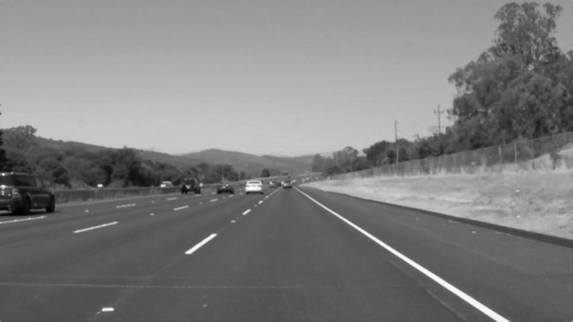
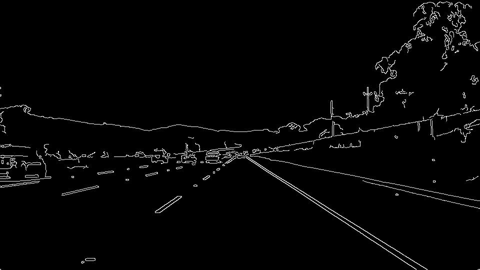
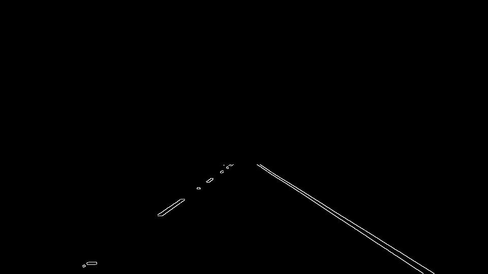
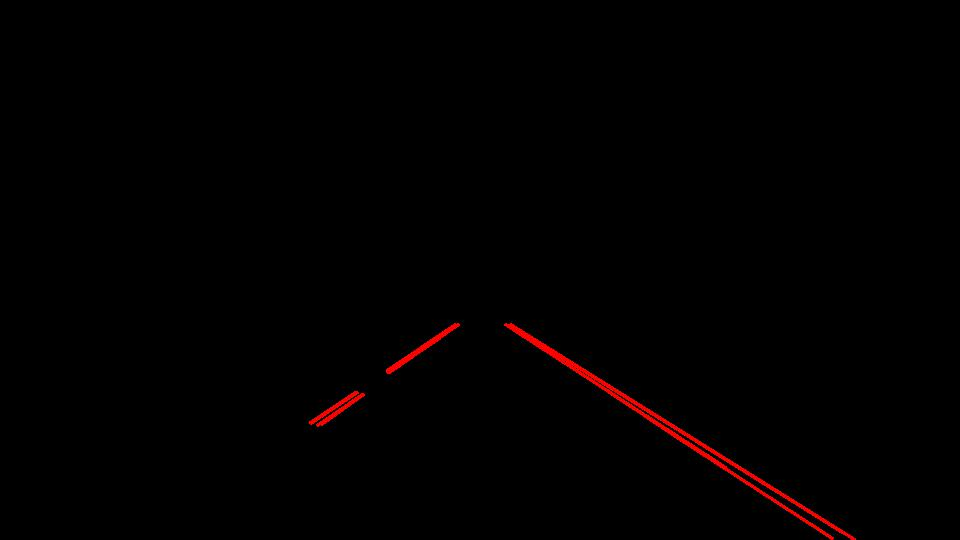
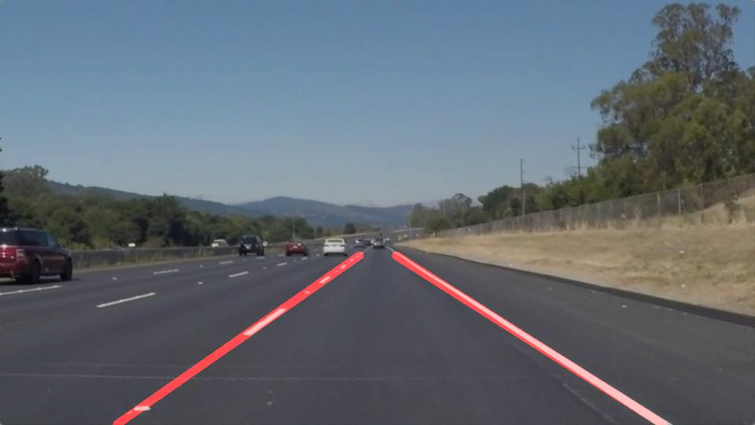

# **Finding Lane Lines on the Road**

**Finding Lane Lines on the Road**

The goals / steps of this project are the following:
* Make a pipeline that finds lane lines on the road
* Reflect on your work in a written report

### Reflection

### 1. Pipeline description

My pipeline consists of 5 main steps:
1. Conversion of image to grayscale

2. Application of gaussian blur to the image

3. Canny edge detection

4. Filtration using Region of intrest

5. Line detection using Hough transform

#### Extrapolation
After finding satisfying parameters I worked on creation of single line for left and right lanes. This was done by adding more steps to the pipeline:

6. Filtration of left and right lines using slope thresholds and x cooridnates.
7. Extrapolation of left and right line using numpys polyfit function.

 First, I converted the images to grayscale, then I ....

Parameters for each of the steps can be found in class Parameters, except vertices for ROI, which can be found in definition of process_image function.

### 2. Identify potential shortcomings with your current pipeline

Potential shortcomings for this pipeline is that it wouldn't work that great in sharp curves. This is due to the filtration of lines using slope and extrapolation of line using polyfit into first degree polynomial.

Another shortcoming is that pipeline is not taking into a count previously detected lines. This could be an issue, since there are frames in which it's really hard to detect lines because of bad lightning, contrast or some other issues. This would mean that in those frames either the lanes are not detected correctly or aren't detected at all.

### 3. Suggest possible improvements to your pipeline

A possible improvement would be to use different color spaces instead of running edge detection on grayscale image. Color is useful information and it could improve detection of lines which would be undetectable on grayscale image.

Another potential improvement could be to to use polyfit with higher degree polynomial. This would improve the detection on curvy roads.
